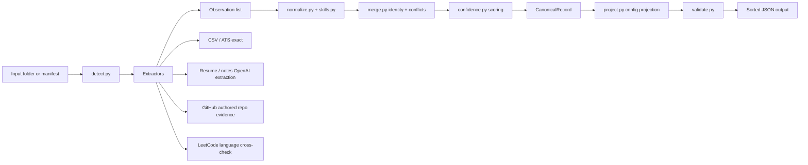
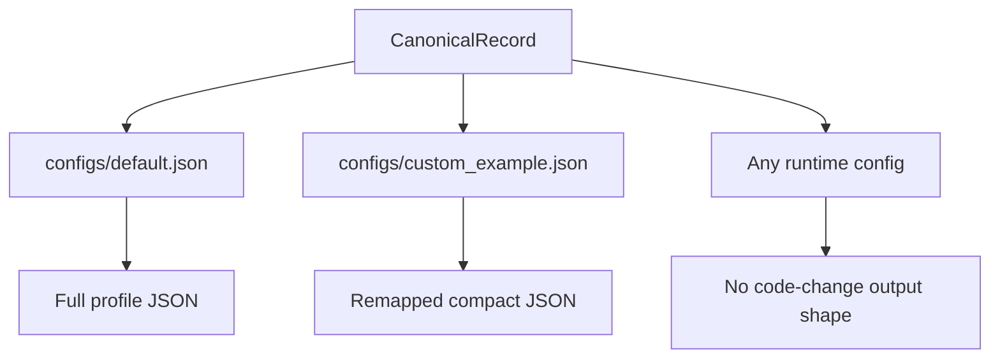

# Multi-Source Candidate Data Transformer

<p>
  
  
  
  
  
  
</p>

A deterministic Python CLI for the Eightfold multi-source candidate transformer assignment. It ingests messy candidate data from ATS JSON, recruiter CSV, resumes, notes, GitHub, and LeetCode evidence, then emits one canonical, deduplicated, provenance-tracked, confidence-scored JSON profile per candidate.

The important design split is:

```text
canonical record != emitted output
```

The merge layer builds the full internal `CanonicalRecord`. The projection layer in `transformer/project.py` is the only output producer, and even the default output shape is just `configs/default.json`.

## Quick Start

```powershell
python -m pip install -r requirements.txt
Copy-Item .env.example .env

python -m transformer --check-llm
python -m transformer --inputs samples\candidate_01 --config configs\default.json
python -m transformer --inputs samples\candidate_01 --config configs\custom_example.json

python -m pytest -q
```

Or run the demo script:

```powershell
.\demo.ps1
```

The repo includes `.cache/responses.db`, pre-seeded with content-hash responses for the sample OpenAI and GitHub calls. The demo and tests run offline and deterministically.

## Run On Your Own Data

Create one folder per candidate:

```text
my_candidate/
  ats.json
  recruiter.csv
  resume.pdf
  github.txt
  leetcode.txt
  notes.txt
```

`github.txt` can contain a profile URL such as:

```text
https://github.com/octocat
```

`leetcode.txt` can contain either a username or profile URL. LeetCode uses a public GraphQL endpoint; if it fails or changes, it adds no evidence and the run continues.

Create `.env`:

```powershell
Copy-Item .env.example .env
```

Set at least:

```env
OPENAI_API_KEY=your_key_here
LLM_PROVIDER=OpenAI
LLM_MODEL=gpt-5.4-mini
LLM_MODEL_CHEAP=gpt-5.4-mini
GITHUB_TOKEN=your_github_token_here
```

`gpt-5.4-mini` is the cheap reliable default. `gpt-5.5` can be used if your key has access and you are comfortable with higher cost. `GITHUB_TOKEN` is required for meaningful GitHub output; without it, GitHub's unauthenticated limit is very low and you will quickly hit rate limits.

Probe the model/key before running a full transform:

```powershell
python -m transformer --check-llm
```

Run default and custom projections:

```powershell
python -m transformer --inputs my_candidate --config configs\default.json --out out\candidate.default.json
python -m transformer --inputs my_candidate --config configs\custom_example.json --out out\candidate.custom.json
```

## Architecture





## What It Supports

| Source | Status | How it is used |
|---|---|---|
| Recruiter CSV | Supported | Exact structured observations. |
| ATS JSON | Supported | Explicit field remap for renamed source fields. |
| Resume TXT/PDF/DOCX | Supported | OpenAI proposes JSON; validators decide what enters the record. |
| Scanned PDF resume | Supported | OCR fallback through `pytesseract` and local Tesseract. |
| Recruiter notes | Supported | Weak free-text skill/seniority hints. |
| GitHub profile | Supported | Authored commits gate strong language evidence. |
| GitHub repo files | Supported | Weak "project uses X" evidence, tiered by taxonomy. |
| GitHub topics | Supported | Weak skill hints only. |
| LeetCode | Supported | Language cross-check through the public GraphQL endpoint; failures return no evidence. |
| ORCID link | Captured only | ORCID URLs can be classified as links, but works are not verified. |
| LinkedIn | Descoped | Links can be retained; profile scraping/verification is not implemented. |

## Evidence Model

The confidence score is a pure function of provenance rows and recorded signals. No LLM decides identity, winners, or scores.

| Evidence | Score delta |
|---|---:|
| Present in one source | `+3` |
| Present in 2+ independent sources | `+2` |
| GitHub authored language evidence | `+3` |
| LeetCode solved-language evidence and claimed elsewhere | `+2` |
| GitHub file signal in infra, CI/CD, DB/API, or framework tier | `+1` |
| Ownership file confirms login in `.mailmap`, `AUTHORS`, `CONTRIBUTORS`, `CODEOWNERS`, or `CITATION.cff` | `+1` |
| Recent repo activity relative to deterministic `RECENCY_AS_OF` | `+0.5` |
| Stars present across authored repos | `+0.25` |
| Only weak uncorroborated evidence | `-1` |
| Tooling-only file signal, such as `tsconfig.json` | `0 skill credit` |

File signals are intentionally conservative. A Dockerfile means "project uses Docker", not "expert in Docker". Topics, stars, and recency can corroborate or break ties, but they do not create top skills by themselves.

## Scale And Batch Mode

Batch mode treats `--inputs` as a directory of per-candidate subfolders and reuses the exact same single-candidate pipeline for each folder:

```powershell
python -m transformer --inputs samples\batch10 --batch --stats --config configs\default.json
```

`samples\batch10` is structured-only, so it runs offline with no API or LLM calls. It includes:

- same-person CSV+ATS folders where email matches, phone formats normalize to E.164, and company conflicts resolve by field trust
- a same-name homonym pair that stays as two profiles because name alone never merges
- varied skills to show different confidence/provenance rows

Scale benchmark:

```powershell
python scripts\scale_benchmark.py --n 1000
```

Sample result on this machine:

```text
{"candidates": 1000, "per_candidate_ms": 50.42, "profiles": 1000, "seconds": 50.423}
{"candidates": 1000, "per_candidate_ms": 4.7, "profiles": 1000, "seconds": 4.705}
DETERMINISTIC: OK
```

The benchmark measures the transformer engine on structured sources, not third-party API throughput. That is the honest scale scope: thousands of local candidate folders, deterministic output, and no network dependency.

## Explainability Report

For a human-readable confidence/provenance report, keep JSON on stdout and print the report to stderr:

```powershell
python -m transformer --inputs samples\candidate_01 --config configs\default.json --report
```

The report formats existing canonical provenance and score breakdowns. It does not recompute merge winners or confidence.

## OpenAI Routing

The LLM wrapper has two deterministic cloud tiers:

| Tier | Config | Used for |
|---|---|---|
| Strong | `LLM_MODEL=gpt-5.5` | Resume and notes extraction. |
| Cheap | `LLM_MODEL_CHEAP=gpt-5.4-mini` | Low-stakes triage, such as choosing which authored GitHub repos to deep-scan. |

Both tiers use temperature `0`, JSON-only prompts, and SQLite content-hash caching. Routing chooses only which model runs or which repos are inspected; validators, merge rules, and confidence scoring remain deterministic.

If a configured model rejects the temperature parameter, the wrapper retries once without that parameter. If the final call fails, it logs a clear one-line warning with the model id instead of silently pretending extraction worked.

## PDF And OCR Resumes

Drop a resume PDF into any input folder:

```text
my_candidate/
  ats.json
  recruiter.csv
  resume.pdf
  notes.txt
  github.txt
```

Run:

```powershell
python -m transformer --inputs my_candidate --config configs\default.json
```

Text-based PDFs are read with `pdfplumber`. Scanned/image-only PDFs use OCR through `pytesseract`, which also needs the Tesseract OCR program installed.

```powershell
winget install UB-Mannheim.TesseractOCR
python -m pip install -r requirements.txt
```

If OCR tooling is missing, scanned pages safely contribute no resume text instead of crashing the run.

## Config

`.env.example` contains every runtime knob:

```env
LLM_PROVIDER=OpenAI
LLM_MODEL=gpt-5.5
LLM_MODEL_CHEAP=gpt-5.4-mini
LLM_TEMPERATURE=0
DEFAULT_REGION=IN
MAX_REPOS=30
MAX_FILES_TO_READ=10
RECENCY_DAYS=365
RECENCY_AS_OF=
GITHUB_TOKEN=
LEETCODE_ENABLED=true
CACHE_PATH=./.cache/responses.db
```

`.env` is git-ignored. Do not commit real API keys.

## Output Examples

Full default output is committed here:

- `samples/candidate_01.gold.json`
- `samples/candidate_01.custom.json`

Custom projection:

```powershell
python -m transformer --inputs samples\candidate_01 --config configs\custom_example.json
```

```json
[
  {
    "_confidence": {
      "full_name": 0.5,
      "phone": 0.5,
      "primary_email": 0.5,
      "skills": 1.0
    },
    "full_name": "Ananya Rao",
    "phone": "+919988776655",
    "primary_email": "ananya.rao@example.com",
    "skills": [
      "Python",
      "JavaScript",
      "Kubernetes",
      "TypeScript",
      "Docker",
      "GitHub Actions"
    ]
  }
]
```

## Repository Layout

```text
transformer/
  __main__.py          CLI entry
  config.py            .env/config loading
  detect.py            source detection
  models.py            pydantic models
  cache.py             SQLite content-hash cache
  llm.py               OpenAI wrapper and routing
  normalize.py         phone/date/country/email normalizers
  skills.py            skill aliases and canonicalization
  merge.py             identity matching and conflict resolution
  confidence.py        pure scoring formula
  project.py           projection engine
  validate.py          projected output validation
  evidence/            file signals and LeetCode evidence
  extractors/          source-specific extractors
configs/
samples/
tests/
```

## Tests

```powershell
python -m pytest -q
```

Current suite covers:

- golden pipeline output
- byte-identical single-candidate and batch determinism
- batch mode stats, conflict handling, and homonym separation
- corrupt source isolation
- phone conflicts and provenance
- homonym non-merge
- normalizers and skill acronyms
- projection path resolver
- PDF and scanned-PDF OCR fallback
- GitHub file-signal tiers
- LeetCode degradation
- cross-confirmed skill confidence
- deterministic recency scoring
- explainability report formatting

## Assumptions

- Eightfold did not provide official sample inputs, so `samples/` contains synthetic fixtures.
- Default phone region is `IN`, configurable through `.env`.
- Name alone never merges two records.
- LeetCode uses a public GraphQL endpoint, so network/API failures fail closed and add no evidence.
- The committed cache fixture exists for repeatable demos.

## Descoped

- ORCID work verification.
- Neo4j graph export.
- LinkedIn profile ingestion or scraping.
- Anthropic is available only when `LLM_PROVIDER=anthropic` is configured; the default path is OpenAI.

## Design Decision

The design decision I am happiest with is the LLM-proposes/deterministic-validators-dispose boundary plus content-hash caching. OpenAI can help turn prose into candidate-shaped JSON, but every proposed value is normalized or rejected before merge. Identity, conflict resolution, and confidence are pure code, so the system can use LLMs while staying deterministic and honest about missing data.

The second design decision is the additive batch wrapper: cross-source dedup stays inside each candidate's canonical merge, while deterministic batch processing proves the same engine scales to thousands of folders with a reproducible result.
